# AI-Based Face Recognition and Smart Bus Pass Verification System
## Comprehensive Project Plan & Architecture Guide

---

## 1. Project Overview & Motivation

In many universities and colleges, student bus passes are verified manually by conductors or drivers checking physical ID cards or printed paper passes. This conventional process suffers from several bottlenecks:
- **Card Sharing / Fraud**: Students lending cards to unregistered peers.
- **Slow Boarding**: Manual inspection causes long queues during peak morning and evening hours.
- **Loss and Damage**: Physical cards get lost, stolen, or worn out.
- **Lack of Real-Time Logs**: Administration has no digital record of who boarded which bus, at what time, and on which route.

### The Proposed Solution
The **Smart Bus Face Recognition and Pass Verification System** automates the boarding process using Computer Vision and Deep Learning. 
When a student stands in front of the camera at the bus entrance:
1. The camera captures their face.
2. The system generates a numerical mathematical representation ("face embedding") using a pretrained neural network (`facenet-pytorch`).
3. It compares this embedding against the registered student database.
4. If a match is found, it immediately checks the student's digital bus pass:
   - **Is the pass active?**
   - **Has the pass expired?**
   - **Is the student boarding the correct bus route?**
   - **Has the student already boarded recently (anti-duplicate entry)?**
5. A green screen indicates **"ACCESS GRANTED"** or a red screen displays the exact rejection reason (e.g., "Pass Expired" or "Invalid Route: Bus 12 instead of Bus 4").
6. The event is automatically logged into an SQLite database.
7. If lighting is poor or face recognition fails, an attendant or student can use a **Manual Fallback** (search by Roll Number / Student ID).
8. An **Admin Dashboard** provides college authorities with full control over student registrations, bus routes, pass approvals, and attendance reports.

---

## 2. Core Concepts Explained for Beginners

Since you are new to Python, AI, and Computer Vision, here is an explanation of the core building blocks without confusing jargon:

### A. What is Face Detection vs. Face Recognition?
* **Face Detection**: Finding *where* a face is in a picture (drawing a bounding box around it). It does **not** identify who the person is. We will use **MTCNN (Multi-task Cascaded Convolutional Networks)** for this.
* **Face Recognition**: Identifying *who* that face belongs to. Once MTCNN crops the face, we pass it to **FaceNet (InceptionResnetV1)** to find their identity.

### B. What is a "Face Embedding"? (The 512-Dimensional Vector)
Instead of comparing raw pixel images (which changes with lighting, head angle, or distance), deep learning models convert a cropped face into a list of **512 floating-point numbers** called an **embedding**.
- Think of this embedding as a unique digital biometric fingerprint.
- If two images are of the same person, their 512 numbers will be very close to each other.
- If two images are of different people, their numbers will be far apart.

### C. How do we compare two faces? (Cosine Similarity & Euclidean Distance)
We compare two 512-number lists using standard geometry:
- **Euclidean Distance**: Measuring the geometric distance between two points in 512-dimensional space.
  - Distance < 0.6 $\rightarrow$ Same person (Match).
  - Distance $\ge$ 0.6 $\rightarrow$ Different person.
- **Cosine Similarity**: Measuring the angle between the two vectors (1.0 = identical, 0.0 = completely unrelated).
We will use **scikit-learn** and **NumPy** to calculate this in milliseconds.

### D. Why `facenet-pytorch` instead of training from scratch?
Training a deep neural network to recognize faces requires millions of photos, high-end supercomputers, and weeks of training. 
`facenet-pytorch` comes with **pretrained weights** (trained on datasets of thousands of people like VGGFace2). We simply use it in "inference mode" — it runs efficiently even on an ordinary college laptop CPU.

### E. Why SQLite?
SQLite is a zero-configuration, serverless database that stores everything in a single `.db` file on your computer. Python has built-in support for SQLite via the `sqlite3` module. No complex servers (like MySQL or PostgreSQL) need to be installed.

### F. Why Streamlit?
Streamlit allows writing web-based user interfaces entirely in Python without needing to learn HTML, CSS, or JavaScript. It is ideal for college demos and rapid prototyping.

---

## 3. High-Level System Architecture

```mermaid
flowchart TD
    subgraph Registration["1. Student Registration Flow"]
        R1[Admin / Student Enters Details] --> R2[Webcam Captures 3-5 Face Images]
        R2 --> R3[MTCNN Detects & Crops Faces]
        R3 --> R4[FaceNet Generates 512-d Embeddings]
        R4 --> R5[(SQLite DB: students, passes, embeddings)]
    end

    subgraph Entrance["2. Bus Entrance Verification Flow"]
        E1[Live Webcam Stream at Bus Gate] --> E2[Detect Face via MTCNN]
        E2 --> E3[Extract Live Embedding]
        E3 --> E4[Compare with Stored Embeddings via Cosine/Euclidean]
        E4 -->|Match Found| E5[Query Bus Pass Database]
        E4 -->|No Match / Low Confidence| E_Manual[Manual Fallback: Enter Roll No]
        E_Manual --> E5
        
        E5 --> E6{Verification Rules Engine}
        E6 -->|Pass Expired| J1[Reject: Pass Expired]
        E6 -->|Wrong Route| J2[Reject: Unauthorized Route]
        E6 -->|Cooldown Triggered| J3[Reject: Duplicate Scan Detected]
        E6 -->|All Checks Pass| J4[GRANT ACCESS: Welcome Onboard!]
        
        J1 & J2 & J3 & J4 --> E7[(Log Attempt to SQLite DB)]
        E7 --> E8[Display Audio / Visual Feedback on Screen]
    end

    subgraph Dashboard["3. Admin & Conductor Dashboard"]
        D1[Streamlit Web App] --> D2[Manage Students & Passes]
        D1 --> D3[Configure Bus Routes]
        D1 --> D4[Live Entrance Monitor]
        D1 --> D5[Export Boarding & Attendance Reports to CSV/Excel]
    end
```



---

## 4. Verification Rules & Business Logic

When a student is recognized, the system applies four sequential rules before opening the gate / granting green status:

```
[Student Recognized: ID #104 - "Aarav Sharma"]
           │
           ▼
┌───────────────────────────────┐
│ Rule 1: Pass Status Active?   │ ── NO ──> REJECT: "Pass Inactive/Suspended"
└───────────────────────────────┘
           │ YES
           ▼
┌───────────────────────────────┐
│ Rule 2: Expiration Check      │ ── NO ──> REJECT: "Pass Expired on YYYY-MM-DD"
│ Current Date <= Expiry Date?  │
└───────────────────────────────┘
           │ YES
           ▼
┌───────────────────────────────┐
│ Rule 3: Route Validity Check  │ ── NO ──> REJECT: "Wrong Route: Assigned to Route 7"
│ Current Bus Route == Pass?    │
└───────────────────────────────┘
           │ YES
           ▼
┌───────────────────────────────┐
│ Rule 4: Duplicate Cooldown    │ ── NO ──> REJECT: "Already Logged (Wait 5 mins)"
│ Last Entry > 5 mins ago?      │
└───────────────────────────────┘
           │ YES
           ▼
┌───────────────────────────────┐
│ RESULT: ACCESS GRANTED        │ ──> Log to attendance_logs with status 'APPROVED'
└───────────────────────────────┘
```

---

## 5. Proposed Folder Structure

A clean, modular structure ensures you can work on one feature at a time without breaking other parts:

```
SmartBusFaceRecognition/
│
├── PROJECT_PLAN.md             # Complete architectural blueprint (this file)
├── TODO.md                     # Step-by-step implementation milestones
├── requirements.txt            # Python dependencies
├── README.md                   # Setup guide and project documentation
│
├── data/
│   ├── smart_bus.db            # SQLite database file
│   └── student_faces/          # Raw captured face snapshots (organized by Roll No)
│       ├── 21CS01/
│       │   ├── img_1.jpg
│       │   └── img_2.jpg
│       └── 21CS02/
│
├── models/
│   └── embeddings.pkl          # Cached precomputed face embeddings (for instant lookup)
│
├── src/
│   ├── __init__.py
│   │
│   ├── database/               # Database management module
│   │   ├── __init__.py
│   │   ├── db_connection.py    # Database connection helper
│   │   ├── schema.py           # Table definitions (DDL)
│   │   └── crud.py             # Create, Read, Update, Delete queries
│   │
│   ├── vision/                 # Face detection and AI recognition module
│   │   ├── __init__.py
│   │   ├── face_detector.py    # MTCNN face detection & cropping
│   │   ├── face_recognizer.py  # FaceNet embedding generation & similarity matching
│   │   └── liveness.py         # Basic anti-spoofing (eye blink / texture - Phase 7)
│   │
│   ├── core/                   # Core business logic
│   │   ├── __init__.py
│   │   ├── pass_verifier.py    # Expiry, Route check & duplicate prevention rules
│   │   └── logger.py           # Verification logging helper
│   │
│   └── utils/                  # Helper utilities
│       ├── __init__.py
│       └── camera.py           # Safe OpenCV webcam wrapper
│
└── app/                        # Streamlit User Interfaces
    ├── main.py                 # Multi-page launcher & navigation
    └── pages/
        ├── 1_Register_Student.py  # Student enrollment & webcam photo capture
        ├── 2_Bus_Entrance.py      # Live webcam recognition & pass verification terminal
        ├── 3_Manual_Fallback.py   # Fallback lookup by Roll Number / Pass ID
        ├── 4_Admin_Dashboard.py   # Manage passes, routes, and view analytics
        └── 5_Logs_and_Reports.py  # Attendance history and CSV export
```

---

## 6. Database Design (SQLite Schema)

The database consists of 4 core tables:

### Table 1: `students`
Stores permanent identity information.
| Column | Type | Constraints | Description |
| :--- | :--- | :--- | :--- |
| `id` | INTEGER | PRIMARY KEY AUTOINCREMENT | Unique record ID |
| `roll_number` | TEXT | UNIQUE, NOT NULL | Student College Roll Number / ID |
| `name` | TEXT | NOT NULL | Full Name of student |
| `department` | TEXT | NOT NULL | e.g. "Computer Science", "Mechanical" |
| `email` | TEXT | UNIQUE | Contact email |
| `phone` | TEXT | | Contact phone |
| `is_active` | INTEGER | DEFAULT 1 | 1 for active student, 0 if graduated/suspended |
| `created_at` | TIMESTAMP | DEFAULT CURRENT_TIMESTAMP | Registration timestamp |

### Table 2: `bus_routes`
Stores available bus routes and stops.
| Column | Type | Constraints | Description |
| :--- | :--- | :--- | :--- |
| `id` | INTEGER | PRIMARY KEY AUTOINCREMENT | Route ID |
| `route_code` | TEXT | UNIQUE, NOT NULL | e.g., "R-101", "ROUTE-EAST-5" |
| `route_name` | TEXT | NOT NULL | e.g., "Downtown to North Campus" |
| `bus_number` | TEXT | NOT NULL | e.g., "BUS-14" |
| `driver_name`| TEXT | | Bus Driver or Conductor Name |

### Table 3: `bus_passes`
Links a student to a route with validity dates.
| Column | Type | Constraints | Description |
| :--- | :--- | :--- | :--- |
| `id` | INTEGER | PRIMARY KEY AUTOINCREMENT | Pass ID |
| `student_id` | INTEGER | FOREIGN KEY (`students.id`) | Student owning the pass |
| `route_id` | INTEGER | FOREIGN KEY (`bus_routes.id`) | Authorized route |
| `pass_type` | TEXT | NOT NULL | "Semester", "Annual", "Monthly" |
| `start_date` | DATE | NOT NULL | Pass valid from |
| `expiry_date`| DATE | NOT NULL | Pass expiration date |
| `status` | TEXT | DEFAULT 'ACTIVE' | 'ACTIVE', 'EXPIRED', 'REVOKED' |

### Table 4: `entry_logs`
Logs every scan attempt at the bus gate.
| Column | Type | Constraints | Description |
| :--- | :--- | :--- | :--- |
| `id` | INTEGER | PRIMARY KEY AUTOINCREMENT | Log ID |
| `student_id` | INTEGER | NULLABLE, FK (`students.id`)| Null if unknown face |
| `route_id` | INTEGER | FOREIGN KEY (`bus_routes.id`) | Current bus route |
| `timestamp` | TIMESTAMP | DEFAULT CURRENT_TIMESTAMP | Exact time of scan |
| `verification_method` | TEXT | NOT NULL | 'FACE_RECOGNITION' or 'MANUAL_FALLBACK' |
| `status` | TEXT | NOT NULL | 'APPROVED', 'REJECTED' |
| `rejection_reason` | TEXT | NULLABLE | 'EXPIRED_PASS', 'WRONG_ROUTE', 'UNKNOWN_FACE', 'DUPLICATE_SCAN' |
| `similarity_score` | REAL | NULLABLE | Cosine confidence score (e.g. 0.89) |
| `snapshot_path` | TEXT | NULLABLE | Path to captured photo |

---

## 7. Anti-Duplicate & Security Features

### Cooldown Timer (Prevent Double-Scanning)
- In real-world bus boarding, a student standing in front of the camera might be recognized 10 times per second.
- We implement a **cooldown window** (e.g., 3 to 5 minutes).
- When a student is approved, their timestamp is recorded. Any subsequent scan of the same student within 5 minutes on the same route will trigger: `DUPLICATE_ENTRY_PREVENTED`.

### Manual Fallback Mechanism
- If a student has a facial injury, wearing a heavy scarf/mask, or lighting conditions are poor, face recognition might fail.
- Instead of stranding the student, the system provides a **Manual Fallback screen**.
- The conductor enters the student's Roll Number or Pass ID.
- The system still runs all validity checks (Expiry Date, Route, Cooldown) and logs the entry as `MANUAL_FALLBACK` for auditing.

### Liveness / Anti-Spoofing (Planned for Later Phase)
- In Phase 7, we will add a lightweight anti-spoofing mechanism (such as eye-blink detection via facial landmark ratios or motion variation) to ensure someone cannot simply hold up a printed photo or phone screen of a student.

---

## 8. Summary of Milestones

| Stage | Focus Area | Deliverable |
| :--- | :--- | :--- |
| **Stage 1** | Setup & Environment | Virtual environment, library installation test |
| **Stage 2** | Database Foundation | SQLite schema creation and test queries |
| **Stage 3** | Face Enrollment | Webcam photo capture, MTCNN + FaceNet embeddings generation |
| **Stage 4** | Verification Engine | Comparison logic, route & date rules, cooldown logic |
| **Stage 5** | Bus Entrance UI | Streamlit live recognition with colored status cards |
| **Stage 6** | Admin Dashboard & Logs | Complete management console with CSV export |
| **Stage 7** | Manual Fallback & Liveness | Manual Roll No verification + basic blink check |
| **Stage 8** | Testing & College Viva Prep | End-to-end verification, demo script & viva questions |
