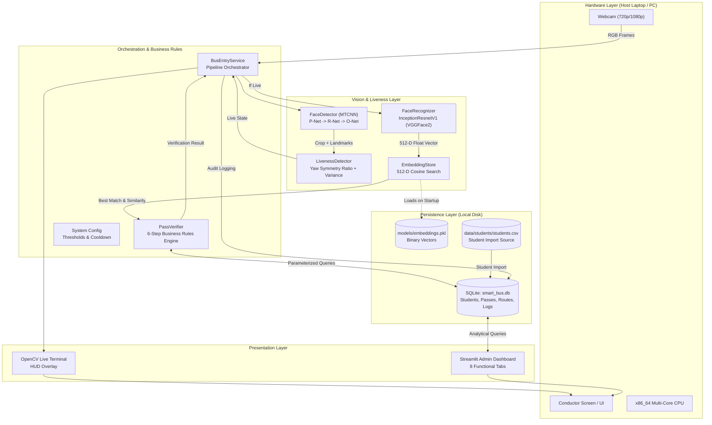
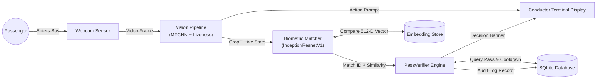
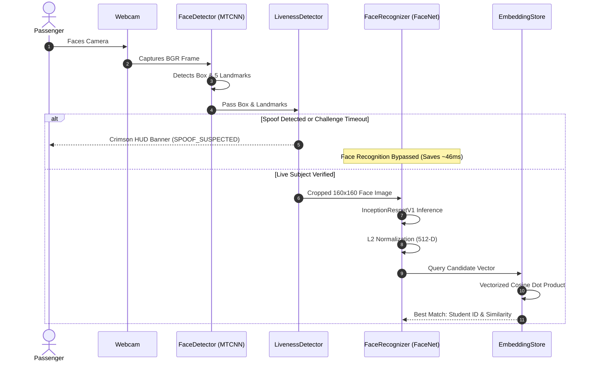
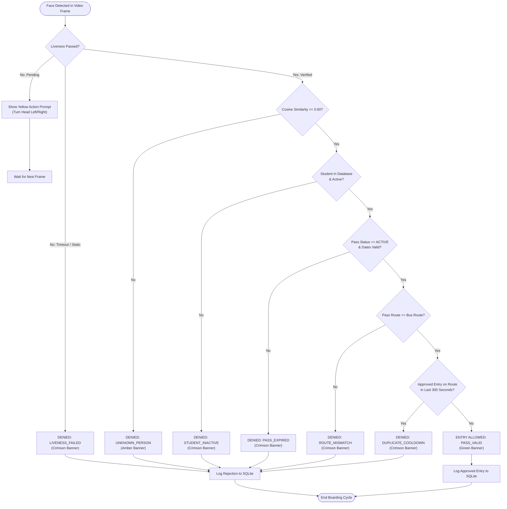
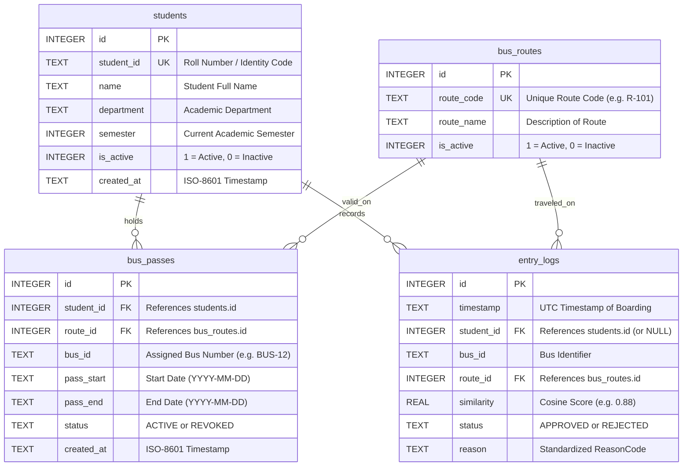
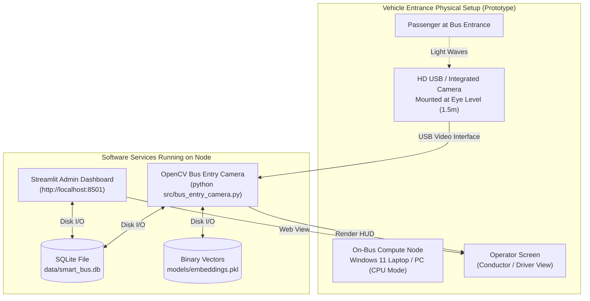

# System Architecture & Technical Diagrams

**Project:** AI-Based Face Recognition and Smart Bus Pass Verification System  
**Stage:** Stage 10 — System Architecture Documentation  
**Date:** 2026-10-03  

---

## 1. System Architecture Diagram

---

## 2. Data Flow Diagram (DFD Level 1)

---

## 3. Face Recognition & Embedding Flow

---

## 4. Bus Entry Decision Flowchart

---

## 5. Entity-Relationship (ER) Diagram

---

## 6. Physical Deployment Diagram (Laptop / Webcam Prototype)

